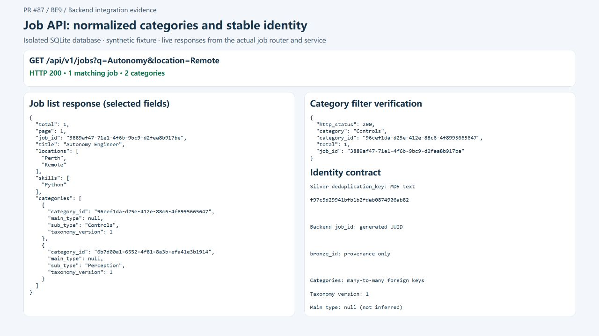

# BE9 review follow-up and API snapshot

## Review requests

| Request | Change |
| --- | --- |
| One entity per file | Split Location, JobLocation, Skill, JobSkill and JobCategory into individual model files; update model registration. |
| Keep sorting and logic out of the router | Move job querying, filters, ordering, pagination and response assembly into `app/services/job.py`. The router only passes HTTP arguments and handles 404. |
| Share small identity helpers | Move identifier validation to `app/utils/validation.py`; keep database job resolution in its service. |
| Share Silver normalization | Move text normalization to `app/utils/normalization.py`. |
| Reuse CLI argument handling | Add `app/utils/cli.py` for JSON input arguments, BOM-aware loading, errors and result output. |
| Keep workflow in a pipeline | Add `SilverPipeline` for source streaming, sessions, transactions, shared writer lock, preflight and category import. Existing command names remain usable. |
| Clarify GUID versus string keys | Keep the upstream MD5 text contract and use representative 32-character keys in identity tests. The dbt model selects `md5(natural_key) as deduplication_key`; only backend `job_id` is a generated UUID. |

## Snapshot



This screenshot shows live responses from the actual job router and service,
using an isolated in-memory SQLite database with explicitly synthetic data.
The list endpoint returns HTTP 200 and two normalized categories. Filtering by
one category returns the same backend job UUID with a total of one.
The left panel shows selected response fields; it is a diagnostic snapshot,
not the production frontend or evidence of a PostgreSQL migration.

Reproduce from `backend/` in PowerShell:

```powershell
$env:DATABASE_URL = 'sqlite://'
python -m scripts.be9_snapshot
```

Open `http://127.0.0.1:8879/`. The example uses its own in-memory engine and does
not read or alter scraper/backend application data. UUIDs change on each demo
startup; this does not represent a Silver resync. Stop it with Ctrl+C.

## Validation

- Ruff passed without disabling rules.
- 43 tests passed, including pipeline commit/rollback and CLI JSON/error handling.
- One opt-in PostgreSQL migration test remains skipped locally.
