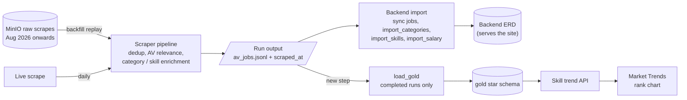
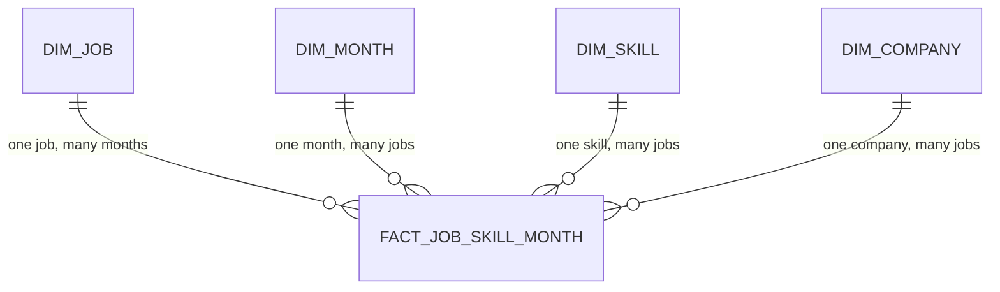

# Gold Trend Mart

Trend data in its own star schema (Postgres schema `gold`), separate from the
backend ERD that serves the site (`document/erd-job-categorizing`). Gold is
loaded from each scrape run's pipeline output, never from the backend tables,
and holds no foreign keys into them. Rebuilding or re-importing the backend
tables therefore never touches trend history. The schema is in
`schema_gold.dbml` (rendered as `gold.pdf`).

## Skill demand over time (DOC-13, #132)

**Status: design for review.** Migration:
`backend/app/sql/doc13_skill_trend_migration.sql`, rollback:
`backend/app/sql/doc13_skill_trend_rollback.sql`.

### Goal

Show how demand for each skill changes month by month, as a "top 10 skills"
rank chart in the style of GitHub's *Top 10 programming languages 2023–2025*.
Scrape runs from August 2026 onwards are kept in MinIO and can backfill it.

### Where the data comes from

Backfill and live runs go through the same pipeline. The only new step is
`load_gold`, after `import_skills`.



### Why the backend tables can't do this

- `job_skill` links a job to a skill with no time information.
- The pipeline keeps one row per job and overwrites its scrape time on every
  run, so nothing keeps history.
- `job_id` is not stable: a full re-import recreates every job, and `job_skill`
  rows cascade-delete with their job. `seed_companies.sql` also runs
  `TRUNCATE company CASCADE`.

### Star schema



| Object | Grain / key | Purpose |
|---|---|---|
| `gold.fact_job_skill_month` | one row per (month, AV job, skill) | This job listed this skill in this month, with the first and last completed run that saw it |
| `gold.dim_month` | `month_key` = yyyymm | Calendar month (UTC), with a label such as "Aug 2026" |
| `gold.dim_skill` | natural key (normalized name, skill type) | Skill and display name |
| `gold.dim_job` | natural key `deduplication_key` | Job title, category area, first/last seen |
| `gold.dim_company` | natural key company name | Company |
| `gold.scrape_run` | one row per scrape run | Load log (not part of the star): source, whether it completed, classifier version |
| `gold.skill_trend_monthly` (view) | one row per (month, skill) | Month-end snapshot: job count, share, rank |

A job is one `dim_job` row and has one fact row per month it was open (with
each of its skills), which is the one-to-many "job seen at many times".

### Decisions

1. **Separate `gold` schema, no foreign keys into the backend.** Foreign keys
   only exist inside the star (fact → dimensions).
2. **Surrogate keys for joins, natural keys for loading.** Each dimension keeps
   its natural key as a unique column, so reloading maps onto the same rows:
   - job: `deduplication_key`, the md5 from the pipeline's dedup step, which
     prefers the ATS job id, then the job URL. The same posting keeps the same
     key across scrapes and re-imports.
   - skill: `(normalized name, skill type)`, normalized like the backend `skill`
     table.
   - company: company name.
3. **Grain (month, job, skill), calendar month in UTC.** Not one row per run:
   daily runs would add roughly 30 × 1.8k jobs × 8 skills ≈ 430k rows a month and
   outgrow the Supabase free tier within months. The monthly grain is about 15k
   rows a month.
4. **Month-end snapshot** (agreed in review). Each month is compared by the AV jobs
   in its **latest completed run**: a fact belongs to the snapshot when its
   `last_seen_at` equals that run's `scraped_at`. Every month is then one
   consistent snapshot from a single classifier version, whatever the number of
   runs. The fact keeps first/last seen for the whole month, so counting "open at
   any time during the month" later would only need a different view.
5. **AV jobs only.** Only jobs that passed relevance in the run are loaded.
6. **Rank and share.** `row_number()` per month by job count, ties broken by name,
   so every rank is unique and two chart lines never share a position.
   `share = job_count / jobs_with_skills` compares months with different numbers
   of open jobs.
7. **Dimension attributes are type 1.** The latest title / category area wins.
   `dim_job.last_seen_at` stops an out-of-order backfill from overwriting newer
   values with older ones.
8. **History is never rewritten.** When the classifier changes, earlier months
   keep what they recorded, and `scrape_run.classifier_version` explains any
   step in the chart. Retention: keep everything (a few MB a month).

### Loading (`load_gold`)

For every scrape run, live or backfilled, in **one transaction**, from the run's
pipeline output (`av_jobs.jsonl`: each line is the job row, with
`deduplication_key`, `company_name` and `job_name`, plus `_classification`, which
holds the categories and skills):

```sql
-- 1. Register the run; if it was already loaded, stop here.
INSERT INTO gold.scrape_run (scraped_at, source, classifier_version, jobs_seen)
VALUES (:scraped_at, :source, :classifier_version, :jobs_seen)
ON CONFLICT (scraped_at) DO NOTHING
RETURNING run_id;

-- Steps 2-4 for completed runs only.
-- 2. The month.
INSERT INTO gold.dim_month (month_key, month_start, year, month, label)
SELECT to_char(d, 'YYYYMM')::integer, d, extract(year FROM d), extract(month FROM d),
       to_char(d, 'Mon YYYY')
FROM (SELECT date_trunc('month', :scraped_at AT TIME ZONE 'UTC')::date AS d) AS m
ON CONFLICT (month_key) DO NOTHING;

-- 3. Per job: its company, the job, each skill, and the fact.
INSERT INTO gold.dim_company (company_name) VALUES (:company_name)
ON CONFLICT (company_name) DO UPDATE SET company_name = excluded.company_name
RETURNING company_key;

INSERT INTO gold.dim_job (deduplication_key, title, main_type, first_seen_at, last_seen_at)
VALUES (:deduplication_key, :job_name, :main_type, :scraped_at, :scraped_at)
ON CONFLICT (deduplication_key) DO UPDATE SET
    title = CASE WHEN excluded.last_seen_at >= gold.dim_job.last_seen_at
                 THEN excluded.title ELSE gold.dim_job.title END,
    main_type = CASE WHEN excluded.last_seen_at >= gold.dim_job.last_seen_at
                     THEN excluded.main_type ELSE gold.dim_job.main_type END,
    first_seen_at = least(gold.dim_job.first_seen_at, excluded.first_seen_at),
    last_seen_at = greatest(gold.dim_job.last_seen_at, excluded.last_seen_at)
RETURNING job_key;

INSERT INTO gold.dim_skill (normalized_name, skill_type, display_name)
VALUES (:normalized_name, :skill_type, :display_name)
ON CONFLICT (normalized_name, skill_type) DO UPDATE SET display_name = excluded.display_name
RETURNING skill_key;

INSERT INTO gold.fact_job_skill_month
    (month_key, job_key, skill_key, company_key, first_seen_at, last_seen_at)
VALUES (to_char(:scraped_at AT TIME ZONE 'UTC', 'YYYYMM')::integer,
        :job_key, :skill_key, :company_key, :scraped_at, :scraped_at)
ON CONFLICT (month_key, job_key, skill_key) DO UPDATE SET
    first_seen_at = least(gold.fact_job_skill_month.first_seen_at, excluded.first_seen_at),
    last_seen_at = greatest(gold.fact_job_skill_month.last_seen_at, excluded.last_seen_at);

-- 4. Mark it completed.
UPDATE gold.scrape_run SET completed = true WHERE run_id = :run_id;
```

- **Only completed runs write facts.** A failed or partial run (e.g. some sources
  didn't scrape) is registered with `completed = false` and nothing else, so it
  can't become a month's snapshot or move `last_seen_at`.
- **Idempotent and order-independent.** Reloading a run is a no-op, and backfill
  runs can be loaded in any order.
- **Where it runs.** Live: a new step in the backend import, right after
  `import_skills`, into the same Supabase database. Backfill: replay each MinIO
  run through the pipeline, then call `load_gold` with that run's historical
  `scraped_at` and `source = 'backfill'`.

Skills come from stage 7 enrichment, which is keyword-first: jobs covered by the
keyword vocabulary get categories and skills without an LLM call
(`KeywordCategoryClassifier` / `KeywordSkillExtractor`), and the rest fall back
to Groq, which returns skills too. So a backfill does cost Groq tokens, for the
stage 6 mid-band and the stage 7 fallback. The classification cache limits that
to new or changed jobs.

### Classification cache (pipeline)

Agreed in review: build it **before the backfill**. It has two benefits:

- **Consistency, the main reason.** Re-running the LLM on the same job doesn't
  reliably return the same skills, even with `GROQ_TEMPERATURE=0`: stage 7 batches
  several jobs per prompt, so a job can land in a different batch each run, and
  the hosted model gets updated. The trend would then compare different
  extractions rather than real changes. With the cache, a posting keeps its first
  result for as long as its text and the classifier version stay the same.
- **Cost.** Jobs that were already classified skip stages 5–7, so only new or
  changed jobs pay for Groq.

How it works:

- **Key:** `deduplication_key` + a hash of the title and description, so an edited
  posting is re-processed.
- **Stored:** relevance decision, categories, skills, classifier/prompt version.
- **Filter skills before caching:** the LLM sometimes returns unwanted or
  meaningless skills, and the cache would freeze them. Keep only skills that map
  to the known skill vocabulary / normalization list.
- **Invalidation:** when the classifier, prompt or vocabulary changes (e.g. #129
  adding Infrastructure), bump the version and re-process once.
- **The trend still records every job:** `load_gold` loads every AV job in the run,
  cached or new. Otherwise the trend would count only new postings.

A sketch: `classification_cache (deduplication_key, content_hash,
classifier_version, is_av_relevant, categories, skills, classified_at)`, primary
key `(deduplication_key, content_hash, classifier_version)`. It belongs to the
pipeline, and the Gold schema works the same with or without it.

### Dependency: keeping one row per scrape

If the pipeline's dedup table starts keeping one row per (job, scrape) instead of
only the latest, the backend job sync (BE-9) must read the **latest row per
`deduplication_key`**, because backend identity requires a unique match. Gold is
fed from each run's output either way.

### Reading: data for the rank chart

Top 10 skills of the latest month, with their rank in every month:

```sql
WITH latest AS (SELECT max(month_key) AS m FROM gold.skill_trend_monthly),
top AS (
    SELECT skill_normalized_name, skill_type
    FROM gold.skill_trend_monthly, latest
    WHERE month_key = latest.m AND rank <= 10
)
SELECT t.month_label, t.snapshot_at, t.skill_name, t.rank, t.job_count, t.share
FROM gold.skill_trend_monthly AS t
JOIN top USING (skill_normalized_name, skill_type)
ORDER BY t.month_key, t.rank;
```

A skill that was outside the top 10 earlier shows its lower rank in those months,
so it enters the chart from below, like the GitHub chart. The company dimension
and `dim_job.main_type` make "skills by company" or "by category area" cheap
later.

### Validation done

Checked on local PostgreSQL 16, with the loader above:

- The migration applies twice; the rollback applies twice, removes the whole
  `gold` schema, and also cleans up the objects earlier drafts of this PR
  created; the migration re-applies afterwards.
- Out-of-order backfill keeps first/last seen and the newest job title; a partial
  run registers without writing anything; reloading a run is a no-op.
- The month-end snapshot uses only the latest completed run of each month. In
  the test, August counts only the 20 Aug run: jobs seen only on 5 Aug and a
  partial run on 28 Aug are excluded.
- The view returns the expected counts, shares, unique ranks and display names.
- Constraints reject a fact outside its month, a fact with an unknown job
  (foreign key), a month whose key and parts disagree, a malformed
  `deduplication_key` and an unknown run source.

### Decided in review

- Gold is a **star schema**, separate from the backend ERD.
- Compare months by their **latest completed run** (month-end snapshot).
- Build the **classification cache before the backfill** (consistency first, then
  tokens), filtering LLM skills against the vocabulary before caching.
- Past months are never rewritten; `scrape_run.classifier_version` records the
  version.

### Open questions

1. **Month boundary.** UTC or Australia/Perth? UTC is simpler, and only runs near
   midnight on the last day of a month are affected.
2. **`load_gold` input.** `handoff.json` only has `deduplication_key`, categories,
   skills and salary. Read `av_jobs.jsonl` directly, or add `job_name` and
   `company_name` to the handoff?

### Follow-ups (not in DOC-13)

- Backend endpoint serving the rank-chart data.
- Frontend rank chart on Market Trends (currently prototype data).
- Category trends via the same star (a category dimension), replacing the unused
  `CategoryTrendSnapshot` draft.

## Regenerating `gold.pdf`

```bash
npx --yes @softwaretechnik/dbml-renderer -i schema_gold.dbml -f svg -o gold.svg
```

Then print the SVG to a single-page PDF, e.g. by wrapping it in an HTML page with
an `@page` size matching the SVG and running headless Chrome/Edge with
`--print-to-pdf --no-pdf-header-footer`.
