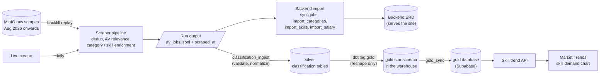
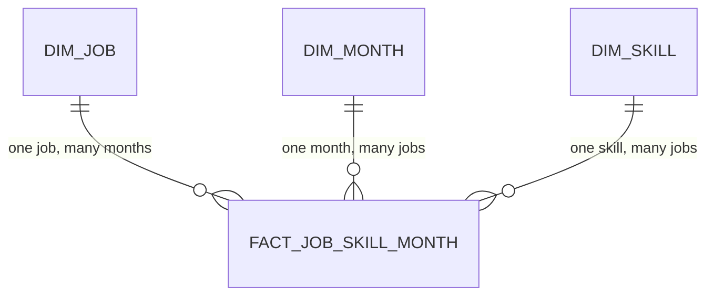

# Gold Trend Mart

Trend data in its own star schema (Postgres schema `gold`), separate from the
backend ERD that serves the site (`document/erd-job-categorizing`). Gold is
built by dbt from the silver classification tables, never from the backend
tables, and holds no foreign keys into them. Rebuilding or re-importing the
backend tables therefore never touches trend history. The schema is in
`schema_gold.dbml` (rendered as `gold.pdf`).

## Skill demand over time (DOC-13, #132)

Code:
- `scrapers/service/silver_cleaning/classification_ingest.py`: lands a run in silver
- `scrapers/dbt/models/gold/`: the gold models (dbt tag `gold`), tests in `schema.yml`
- `scrapers/service/silver_cleaning/gold_sync.py`: copies gold to the gold database

### Goal

Show how demand for each skill changes month by month, as a "top 10 skills"
rank chart in the style of GitHub's *Top 10 programming languages 2023–2025*.
Scrape runs from August 2026 onwards are kept in MinIO and can backfill it.

### Where the data comes from

Backfill and live runs go through the same pipeline. After the LLM
enrichment (stage 8), stage 9 lands the run's classification output in
silver, dbt rebuilds gold from silver, and gold is copied to its own database.


```mermaid
flowchart LR
    MINIO[("MinIO raw scrapes<br/>Aug 2026 onwards")] -- "backfill replay" --> PIPE
    LIVE["Live scrape"] -- "daily" --> PIPE
    PIPE["Scraper pipeline<br/>dedup, AV relevance,<br/>category / skill enrichment"] --> OUT[/"Run output<br/>av_jobs.jsonl + scraped_at"/]
    OUT --> IMPORT["Backend import<br/>sync jobs, import_categories,<br/>import_skills, import_salary"] --> ERD[("Backend ERD<br/>(serves the site)")]
    OUT -- "classification_ingest<br/>(validate, normalize)" --> SILVER[("silver<br/>classification tables")]
    SILVER -- "dbt tag:gold<br/>(reshape only)" --> GOLD[("gold star schema<br/>in the warehouse")]
    GOLD -- "gold_sync" --> GOLDDB[("gold database<br/>(Supabase)")]
    GOLDDB --> API["Skill trend API"] --> CHART["Market Trends<br/>skill demand chart"]
```

### Why the backend tables can't do this

- `job_skill` links a job to a skill with no time information.
- The pipeline keeps one row per job and overwrites its scrape time on every
  run, so nothing keeps history.
- `job_id` is not stable: a full re-import recreates every job, and `job_skill`
  rows cascade-delete with their job. `seed_companies.sql` also runs
  `TRUNCATE company CASCADE`.

### Silver: the classification tables

`classification_ingest` writes one scrape run's `av_jobs.jsonl` into three
primitive silver tables. **Silver is the last layer that cleans data**: rows are
validated here (a malformed row rejects the whole run), skill names are
normalized like the backend `skill` table (whitespace collapsed, lower case), and
each job's `main_type` is resolved from its categories via
`scrapers/config/category_main_types.yaml`.

| Table | Grain | Notes |
|---|---|---|
| `silver.classification_run` | one row per scrape run | `scraped_at` (PK), source (`live` / `backfill`), `classifier_version`, `completed`, `jobs_seen` |
| `silver.classified_job` | (run, AV job) | title, `main_type` |
| `silver.classified_job_skill` | (run, AV job, skill) | normalized name, skill type, display name |

- `--scraped-at` is when the run scraped, not the pipeline's `ingested_at`
  (processing time).
- Ingesting a run that is already there is a no-op; `--replace` swaps its rows
  (e.g. after re-running the classifier on the same scrape).
- `--incomplete` registers a failed or partial run without its jobs, so it can
  never become a month's snapshot.

```bash
python -m scrapers.service.silver_cleaning.classification_ingest \
    data/job_classification/av_jobs.jsonl --scraped-at 2026-08-31T14:17:29Z \
    --source backfill --classifier-version <version>
```

It then runs `dbt run --select tag:gold` and `gold_sync` (`--skip-gold` skips both).

In the pipeline (`python -m scrapers.utils.pipeline_runner`) this is stage 9, run
after the enrichment. It keeps only the jobs in this run's Silver export, since
`av_jobs.jsonl` can still hold jobs from earlier runs (the enricher resumes from
its output directory), and takes `scraped_at` from the newest
`bronze.raw_responses.fetched_at` unless `--scraped-at` is given. `--skip-gold`
skips the stage.

### Gold: the star schema (dbt)

The gold models **only reshape** silver, with no further cleaning. Every model
reads completed runs only.


```mermaid
erDiagram
    DIM_JOB ||--o{ FACT_JOB_SKILL_MONTH : "one job, many months"
    DIM_MONTH ||--o{ FACT_JOB_SKILL_MONTH : "one month, many jobs"
    DIM_SKILL ||--o{ FACT_JOB_SKILL_MONTH : "one skill, many jobs"
```

| Object | Grain / key | Purpose |
|---|---|---|
| `gold.fact_job_skill_month` | one row per (month, AV job, skill) | This job listed this skill in this month, with the first and last completed run that saw it |
| `gold.dim_month` | `month_key` = yyyymm | Calendar month (UTC), with a label such as "Aug 2026" |
| `gold.dim_skill` | `skill_key` = md5(normalized name, skill type) | Skill and display name (from the newest run) |
| `gold.dim_job` | `deduplication_key` | Job title and category area (newest run wins), first/last seen |
| `gold.scrape_run` | one row per completed run | Run times and classifier version, so gold works without silver |
| `gold.skill_trend_monthly` (view) | one row per (month, skill) | Month-end snapshot: job count, share, rank |

A job is one `dim_job` row and has one fact row per month it was open (with
each of its skills), which is the one-to-many "job seen at many times".

### Decisions

1. **Separate `gold` schema, no foreign keys into the backend.** Relationships
   only exist inside the star (fact → dimensions), checked by dbt tests.
2. **Stable natural keys.** dbt rebuilds the tables, so keys must not depend on
   load order:
   - job: `deduplication_key`, the md5 from the pipeline's dedup step, which
     prefers the ATS job id, then the job URL. The same posting keeps the same
     key across scrapes and re-imports.
   - skill: md5 of `(normalized name, skill type)`.
   - month: yyyymm.
3. **Grain (month, job, skill), calendar month in UTC.** Not one row per run:
   daily runs would add roughly 30 × 1.8k jobs × 8 skills ≈ 430k rows a month and
   outgrow the Supabase free tier within months. The monthly grain is about 15k
   rows a month.
4. **Month-end snapshot** (agreed in review). Each month is compared by the AV jobs
   in its **latest completed run**: a fact belongs to the snapshot when its
   `last_seen_at` equals that run's `scraped_at`. Every month is then one
   consistent snapshot from a single classifier version, whatever the number of
   runs. The fact keeps first/last seen for the whole month, so counting "open at
   any time during the month" later would only need a different view.
5. **AV jobs only.** Only jobs that passed relevance in the run are loaded.
6. **Rank and share.** `row_number()` per month by job count, ties broken by name,
   so every rank is unique and two chart lines never share a position.
   `share = job_count / jobs_with_skills` is kept for later; the chart shows
   **raw counts** (agreed in review).
7. **Dimension attributes are type 1.** The newest completed run's title and
   category area win, whatever order runs were ingested in.
8. **No company dimension** (agreed in review). The rank chart doesn't use
   company, so it's left out.
9. **All cleaning happens in silver** (agreed in review). The gold models only
   select, join and aggregate.
10. **Gold lives in its own database** (option A, agreed in review). dbt builds it
    in the warehouse next to bronze and silver (dbt uses one database, and
    Postgres can't query across databases); `gold_sync` then copies the schema.
11. **History is kept in silver.** Silver keeps every ingested run, and gold is
    rebuilt from it, so past months stay as recorded unless a run is explicitly
    `--replace`d. `scrape_run.classifier_version` explains any step in the chart.

### Copying to the gold database (`gold_sync`)

`gold_sync` dumps the `gold` schema from the warehouse (`pg_dump --schema gold`)
and restores it into `GOLD_DATABASE_URL` with `pg_restore --clean --if-exists
--single-transaction`, so a failed copy leaves the previous one in place. Gold is
self-contained (the trend view reads `gold.scrape_run`, not silver), so the copy
works without the silver tables. Without `GOLD_DATABASE_URL` the step is skipped.

- `GOLD_DATABASE_URL` goes in `scrapers/.env` (never committed). Supabase's direct
  `db.<ref>.supabase.co` host is IPv6-only; on an IPv4 network use the **Session
  pooler** connection string from the project's Connect dialog.
- No Data API grants: the `anon` role can't read gold; the backend reads it over
  a direct connection.

```bash
python -m scrapers.service.silver_cleaning.gold_sync
```

### Reading: data for the rank chart

Top 10 skills of the latest month, with their rank in every month:

```sql
WITH latest AS (SELECT max(month_key) AS m FROM gold.skill_trend_monthly),
top AS (
    SELECT skill_normalized_name, skill_type
    FROM gold.skill_trend_monthly, latest
    WHERE month_key = latest.m AND rank <= 10
)
SELECT t.month_label, t.snapshot_at, t.skill_name, t.rank, t.job_count, t.share
FROM gold.skill_trend_monthly AS t
JOIN top USING (skill_normalized_name, skill_type)
ORDER BY t.month_key, t.rank;
```

A skill that was outside the top 10 earlier shows its lower rank in those months,
so it enters the chart from below, like the GitHub chart. `dim_job.main_type`
makes "skills by category area" cheap later.

### Classification cache (pipeline)

Agreed in review before the backfill, mainly for consistency: re-running the LLM
on the same job doesn't reliably return the same result. Since #141, skills
come from the deterministic keyword extractor over the full description, so they
are stable across runs; the cache would still matter for relevance and
categories, and for Groq cost. A sketch: `classification_cache (deduplication_key,
content_hash, classifier_version, is_av_relevant, categories, skills,
classified_at)`, primary key `(deduplication_key, content_hash,
classifier_version)`. It belongs to the pipeline; gold works the same with or
without it.

### Dependency: keeping one row per scrape

If the pipeline's dedup table starts keeping one row per (job, scrape) instead of
only the latest, the backend job sync (BE-9) must read the **latest row per
`deduplication_key`**, because backend identity requires a unique match. Gold is
fed from each run's output either way.

### Validation done

On local PostgreSQL 16 (warehouse) and the Supabase gold database (PostgreSQL 17):
- `dbt build --select tag:gold`: all 6 models, 24 data tests and 3 unit tests pass.
  The unit tests cover the newest-wins job, the fact grain (partial runs
  excluded) and the month-end snapshot (early-only jobs excluded).
- The dbt unit tests also pass with no silver or gold tables present, as in CI.
- Real data: Martin's rerun of the Aug 31 and Sep 12 runs (same pipeline and
  vocabulary for both months). Aug: 1,105 jobs, 6,172 skill rows; Sep: 1,229 jobs,
  7,337 skill rows; 715 of the 727 jobs in both months have identical skills.
  Top of September: Python 806 (Aug 664), C++ 713 (625), machine learning 463 (427).
- `gold_sync` to the Supabase gold database: the copy matches the warehouse
  (2 runs, 2 months, 1,607 jobs, 145 skills, 13,509 facts, 284 trend rows), and a
  second sync replaces it cleanly.

### Decided in review

- Gold is a **star schema**, separate from the backend ERD, with no company
  dimension.
- Compare months by their **latest completed run** (month-end snapshot).
- Build it with **dbt**; all cleaning in silver, gold only reshapes.
- Gold in **its own PostgreSQL database**, copied from the warehouse (option A).
- The chart uses raw counts; the September source jump (7 new API sources) is
  documented for the client rather than shown in the UI.

### Open question

- **Month boundary:** UTC (current) or Australia/Perth? Only runs near midnight on
  a month's last day are affected.

### Serving it (FE-20, #143)

- Backend: `GET /api/v1/trends/skills?limit&months` (`backend/app/services/skill_trend.py`)
  reads `gold.skill_trend_monthly` over `GOLD_DATABASE_URL` and returns 503 when
  it isn't set, so the deployed backend needs that variable too.
- Frontend: the Market Trends page (`/trends`) shows monthly job counts for the
  top 8 skills, with a table view. It uses raw counts rather than ranks, as
  agreed in review.

### Follow-ups

- Category trends via the same star (a category dimension), replacing the unused
  `CategoryTrendSnapshot` draft.

## Regenerating `gold.pdf`

```bash
npx --yes @softwaretechnik/dbml-renderer -i schema_gold.dbml -f svg -o gold.svg
```

Then print the SVG to a single-page PDF, e.g. by wrapping it in an HTML page with
an `@page` size matching the SVG and running headless Chrome/Edge with
`--print-to-pdf --no-pdf-header-footer`.
