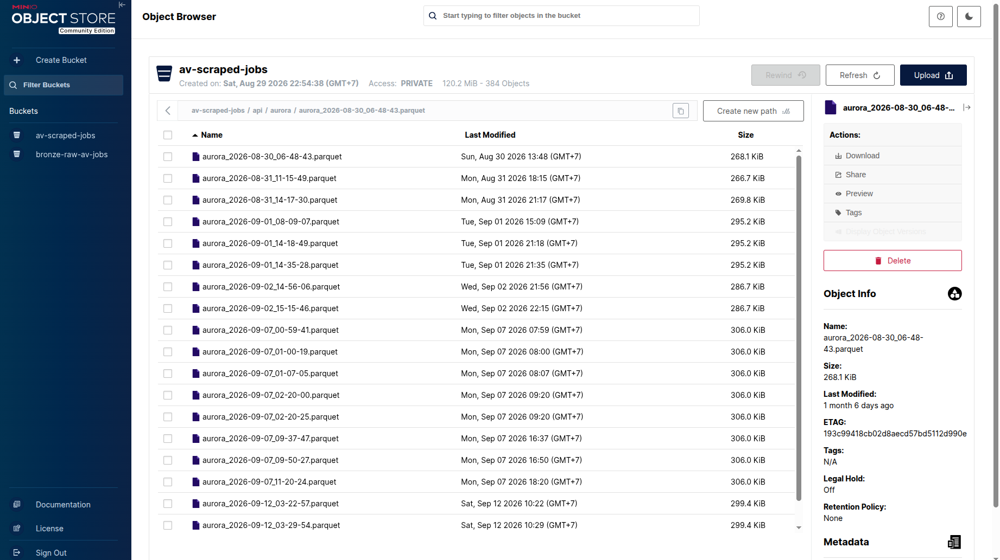
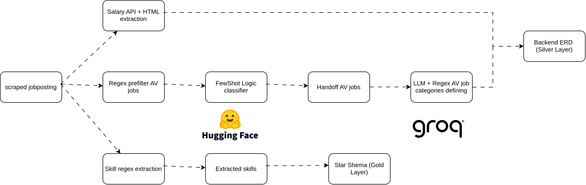
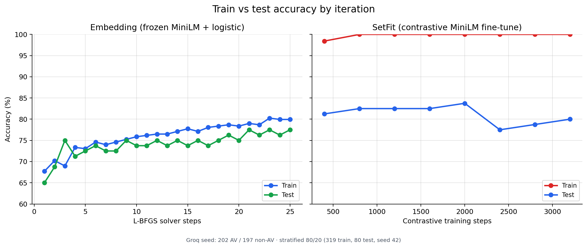

# Scrapers: environment setup

How to set up and run the data pipeline that collects job ads: scraping, MinIO, the Postgres `bronze` layer, the pre-filter and the full pipeline. For the overview of the whole project, see the [main README](../../README.md).

The scraper only reads public job advertisements. It does not submit applications or collect applicant information.

Run every command here from the **repository root**. YAML paths and `.env` loading are relative to the current directory.

## Contents

- [What you need](#what-you-need)
- [1. Install the Python packages](#1-install-the-python-packages)
- [2. Start MinIO](#2-start-minio)
- [3. Configure the environment](#3-configure-the-environment)
- [4. Run the scraper](#4-run-the-scraper)
- [5. Pre-filter jobs before the LLM](#5-pre-filter-jobs-before-the-llm)
- [6. Run the full pipeline](#6-run-the-full-pipeline)
- [7. Load the results into the backend](#7-load-the-results-into-the-backend)
- [Run the tests](#run-the-tests)
- [Troubleshooting](#troubleshooting)
- [Design notes](#design-notes)

## What you need

| Need | For |
|---|---|
| Python 3.10+ | everything |
| Docker | a local MinIO server (and optionally Postgres) |
| A PostgreSQL database | the `bronze`, `silver` and `gold` layers (same database as the backend, see the [backend setup in the README](../../README.md#run-it-without-docker)) |
| A Groq API key | only for the LLM classification and enrichment stages |
| A Comeet token | only for the AutoBrains source |

## 1. Install the Python packages

```bash
python3 -m pip install -r scrapers/requirements.txt
# or, to run the tests as well:
python3 -m pip install -r scrapers/requirements-test.txt
```

The runtime packages include `sentence-transformers` and therefore torch, so the first install downloads several gigabytes. Use a virtual environment.

## 2. Start MinIO

The scraper writes the raw responses to MinIO as Parquet files.

```bash
docker run -d --name minio \
  -p 9000:9000 \
  -p 9001:9001 \
  -e MINIO_ROOT_USER=minioadmin \
  -e MINIO_ROOT_PASSWORD=minioadmin \
  quay.io/minio/minio server /data --console-address ":9001"
```

- API: `http://localhost:9000`
- Console: `http://localhost:9001` (log in with `minioadmin` / `minioadmin`)

If a MinIO is already running on the machine, skip Docker and point the settings below at it. If port `9000` is already taken, the container fails to start: stop the other service or publish different ports (for example `-p 19000:9000`) and set `MINIO_ENDPOINT` to match.

## 3. Configure the environment

Copy the sample and fill it in. The settings are read from a `.env` in the repository root or from `scrapers/.env`:

```bash
cp scrapers/.env.sample scrapers/.env
```

| Setting | Needed for | Notes |
|---|---|---|
| `MINIO_ENDPOINT`, `MINIO_ACCESS_KEY`, `MINIO_SECRET_KEY`, `MINIO_SECURE`, `MINIO_JOBS_BUCKET` | scraping | Must match the MinIO root user and password. `MINIO_SECURE=false` for local HTTP. The bucket is created on first use. These defaults already match the Docker command above. |
| `POSTGRES_HOST`, `POSTGRES_PORT`, `POSTGRES_DB`, `POSTGRES_USER`, `POSTGRES_PASSWORD` | loading `bronze` and the dbt models | Same database and credentials as the backend. |
| `COMEET_TOKEN` | the AutoBrains source | Comeet's public read-only careers-API token. Without it only that company fails. |
| `GROQ_API_KEY` | LLM stages | One key, or several separated by commas; the client rotates to the next after repeated rate-limit errors. |
| `GROQ_MODEL`, `GROQ_TEMPERATURE`, `GROQ_REASONING_EFFORT`, `GROQ_MAX_COMPLETION_TOKENS`, `GROQ_TPM_LIMIT` | optional | Defaults are in `scrapers/config/groq.py`. |
| `CHROME_BIN` | optional | Only for sources that need a headless browser (`render: true`). Leave unset to let Selenium find Chrome. |

After archiving the files, the scraper loads them into the `bronze` schema in Postgres and builds the dbt models, so the `POSTGRES_*` settings are needed too. Without a password the archive step still works but the Postgres step stops with `no password supplied`.

## 4. Run the scraper

```bash
python3 -m scrapers.scraper_main
```

A full run takes a long time. Greenhouse, SmartRecruiters and Workday need one request per job, and Bosch alone has about 4,800 postings on SmartRecruiters. Expect hours, not minutes. While developing, run one source:

```bash
python3 -m scrapers.scraper_main --company stack_av --max-jobs 10
```

| Flag | Default | Meaning |
|---|---|---|
| `--company` | all enabled companies | Run one company by its `key` in `scrapers/data/list_companies.yaml` |
| `--max-jobs` | no limit | Keep at most this many jobs from each API company response, applied before the per-job detail requests. HTML and XML sources are not trimmed. |
| `--timeout` | `30` | HTTP timeout in seconds |

Companies with `enabled: false` are skipped. Raw responses are stored as:

```text
{bucket}/api/{company_slug}/{company_slug}_{YYYY-MM-DD_HH-MM-SS}.parquet
```

Browse them in the MinIO console under the `scraped-jobs` bucket.



## 5. Pre-filter jobs before the LLM

A deterministic filter drops clearly non-AV roles before they reach the LLM. Run it on a CSV, JSON array or JSON Lines export of `bronze.job_postings`:

```bash
python3 -m scrapers.utils.job_prefilter \
  --input scrapers/data/sample_data/job_postings_202609011519.csv \
  --output-dir data/job_prefilter
```

It writes four files:

| File | Contents |
|---|---|
| `llm_candidates.jsonl` | rows allowed to go on to classification |
| `excluded_jobs.jsonl` | excluded rows with the decision and an audit category |
| `filter_metrics.json` | before, after, excluded and reduction counts per company |
| `filter_decisions.csv` | one review-friendly line per input job |

A committed example from 100 Silver rows is in `scrapers/data/sample_data/job_prefilter_decisions_sample.csv`.

The rules are in `scrapers/config/job_prefilter.yaml`; set `AV_JOB_PREFILTER_CONFIG` or pass `--config` to use another file. The safe default excludes only explicit corporate and support titles and sends unknown roles to the LLM. Set `exclude_below_threshold: true` only after the positive keyword rules have been checked against representative data.

From a notebook:

```python
from scrapers.service.llm import JobPrefilter

prefilter = JobPrefilter.from_config()
filter_result = prefilter.filter(jobs_df.to_dict(orient="records"))
filter_result.write_outputs(PROJECT_ROOT / "data" / "job_prefilter")
llm_jobs_df = pd.DataFrame(filter_result.included).drop(
    columns=["_prefilter"], errors="ignore"
)
```

`jobs_df`, `PROJECT_ROOT` and `pd` come from your notebook. Only `llm_jobs_df` should be sent to the model.

## 6. Run the full pipeline

One command chains scraping, MinIO, `bronze`, `silver` (dbt), export, pre-filter, the embedding relevance check, and LLM enrichment, stopping at the first stage that fails:

```bash
python3 -m scrapers.pipeline_main
```

To re-run only the processing stages on data already in Postgres, for example after fixing a prompt or rotating Groq keys:

```bash
python3 -m scrapers.pipeline_main --skip-scrape --skip-silver-build
```

The result is `data/job_classification/av_jobs.jsonl`, the AV-relevant jobs with categories and skills. All flags are listed by `python3 -m scrapers.pipeline_main --help` and described in [document/scrapers/README.md](../scrapers/README.md).

## 7. Load the results into the backend

Loading the classified jobs into the backend tables (`jobposting`, `category`, `skill`, and so on) is a separate, manual step. Build the hand-off file, then use the backend commands:

```bash
python3 -m scrapers.utils.build_classification_handoff \
  --input data/job_classification/av_jobs.jsonl \
  --output data/job_classification/handoff.json
```

The sync, category, skill and salary imports, and the Supabase mirror, are described in [document/backend/SILVER_SYNC.md](../backend/SILVER_SYNC.md).

## Run the tests

```bash
python3 -m pytest scrapers/tests/unit_test scrapers/tests/integration_test -v
```

## Troubleshooting

| What you see | Cause and fix |
|---|---|
| `no password supplied` right after "Archived …" | The `POSTGRES_*` settings are missing. Add them (step 3). |
| `unset environment variable for params.token` for AutoBrains | `COMEET_TOKEN` is not set. Other companies still run. |
| MinIO container does not start | Port 9000 or 9001 is in use. Stop the other service or publish other ports. |
| A full run seems stuck on one company | It is fetching one request per job. Check the log; use `--company` to run others. |
| Postgres rejects the connection | Check host and port (`5432` for a local install, the port you published for Docker) and the password. |

## Design notes

How the scraped data shapes the pipeline, and why the classifier looks the way it does.

### Job posting handling flow



Each scraped posting fans out into three independent branches:

| Branch | Steps | Output |
|---|---|---|
| Salary | Salary API and HTML extraction | Silver layer (backend ERD) |
| Classification | Regex pre-filter, few-shot classifier, hand-off of AV jobs, LLM and regex category definition | Silver layer (backend ERD) |
| Skills | Regex skill extraction | Extracted skills, then the star schema (gold layer) |

- **Cheap, deterministic steps first.** The pre-filter and the few-shot classifier drop clearly non-AV roles, so only the hand-off set pays for LLM calls.
- **LLM and regex together for categories.** The LLM handles ambiguous titles; regex rules keep the taxonomy consistent and auditable.
- **Independent branches.** A failure in one (for example an LLM outage) does not block the others, and each can be re-run or tuned alone.
- **Skills use regex, not the LLM.** A fixed vocabulary lookup is repeatable and free to re-run over the whole bronze history.

### How the scraped data shapes the design

| What the scraped data looks like | Design decision |
|---|---|
| 38 enabled companies on different sources: 30 ATS APIs, 7 HTML pages and 1 XML feed | Store every raw payload untouched in MinIO and `bronze.raw_responses` (JSONB), then parse it with one dbt model per source |
| Fields are inconsistent or missing across sources (salary, location, description) | Keep optional fields nullable and normalise only in the silver layer, so raw evidence is never lost |
| Some list pages have no description | `RawFetch` also fetches each job's detail page and embeds it in the bronze payload |
| The row id is a volatile `row_number()` between runs | Use `job_id`, the ATS-native posting id (falling back to the URL, then a content hash), for joins and cross-run comparison |
| Descriptions are free text with no structured skills or category | Run regex skill extraction on the cleaned text, and use the pre-filter, classifier and LLM for AV relevance and category |
| Salary is a structured field for some sources and only in the text for others | Run salary as its own branch, so it can be re-run or tuned independently |

Because bronze keeps the raw responses, any parser, classifier or skill list can be changed and re-run over the whole history without scraping again.

### Why this classifier

Frozen embedding with logistic regression versus SetFit, on the same Groq-labelled seed set (202 AV and 197 non-AV postings, stratified 80/20 split).



- **Frozen MiniLM + logistic regression** trains and tests close together (about 80% train, 77% test), so it generalises steadily.
- **SetFit** reaches 100% train accuracy almost immediately, while test accuracy peaks near 84% and then falls to 78-80%. It overfits on a seed set this small.

### Why not a full deep learning model

| Factor | Our project |
|---|---|
| Labelled data | 399 Groq-labelled postings (319 train / 80 test) |
| Sources | 38 enabled companies |
| Postings | about 5,400 scraped; 1,229 AV postings shown on the platform |
| Labelling cost | LLM labels cost money per call, so labelling thousands of postings was not practical |

- **Too few labels for end-to-end training.** A large network fitted on about 400 examples memorises them.
- **Few-shot reuses a pretrained encoder.** MiniLM already understands language, so a small classifier head is enough to separate AV from non-AV roles.
- **The classifier is a cheap first gate.** It keeps LLM cost down as more companies are added.
- **Easy to re-run.** A frozen embedding plus logistic regression fits in seconds, so the model can be retrained whenever the seed set grows.
